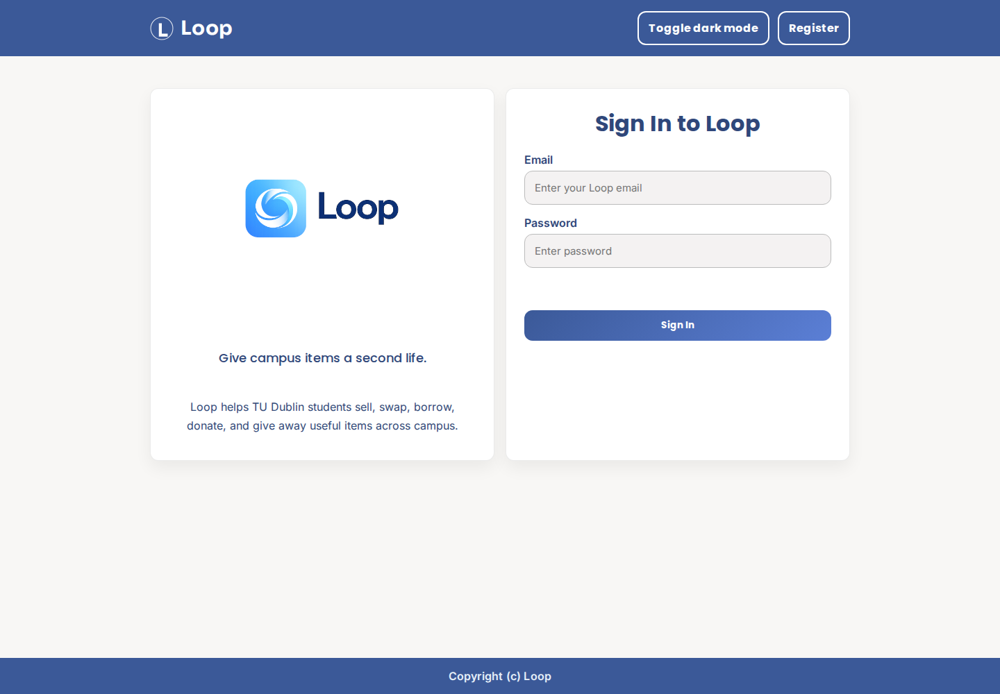
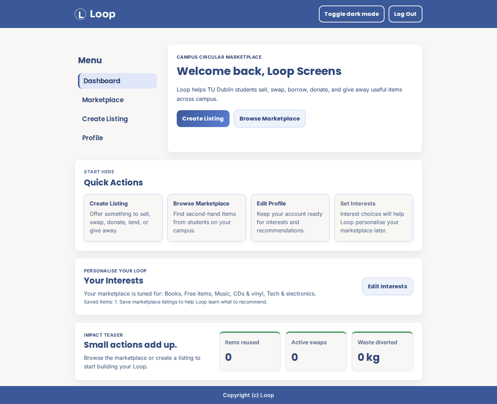
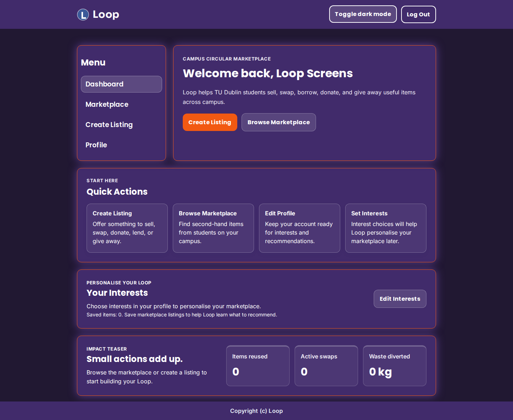
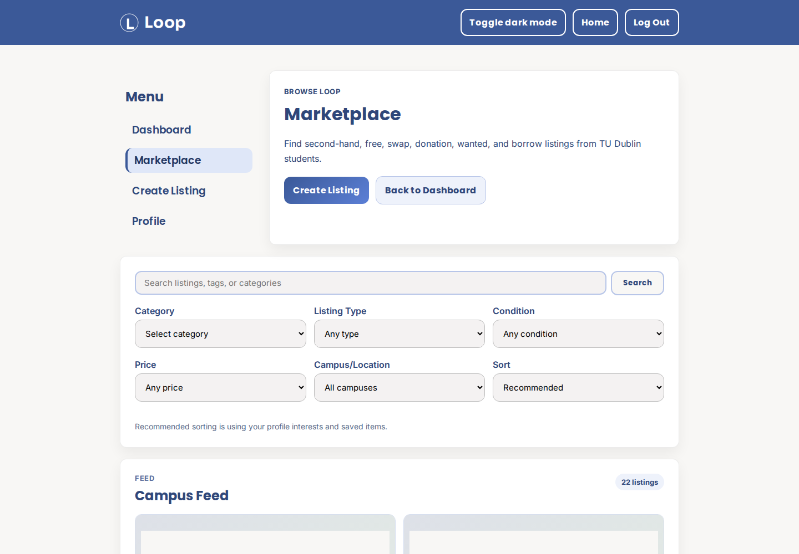
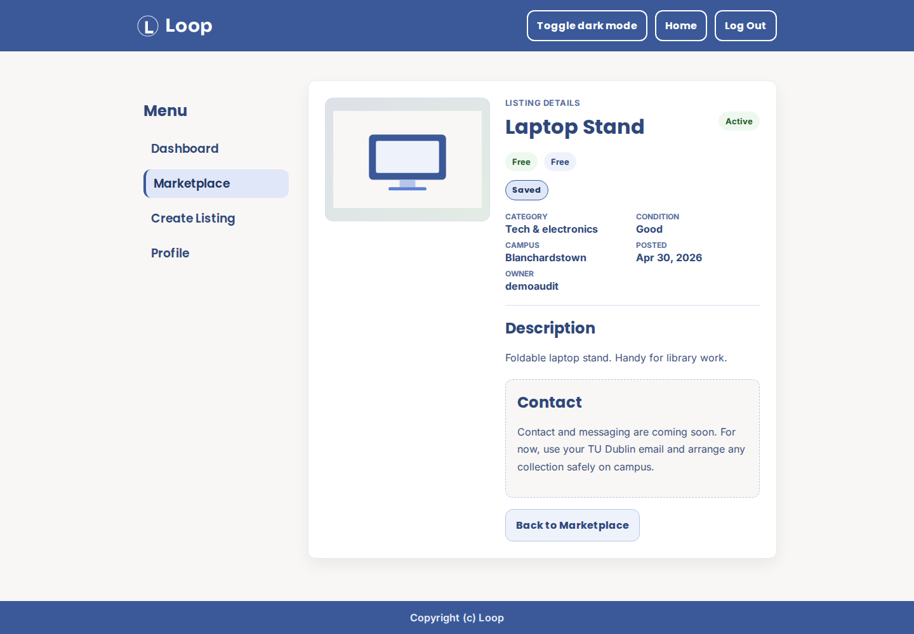
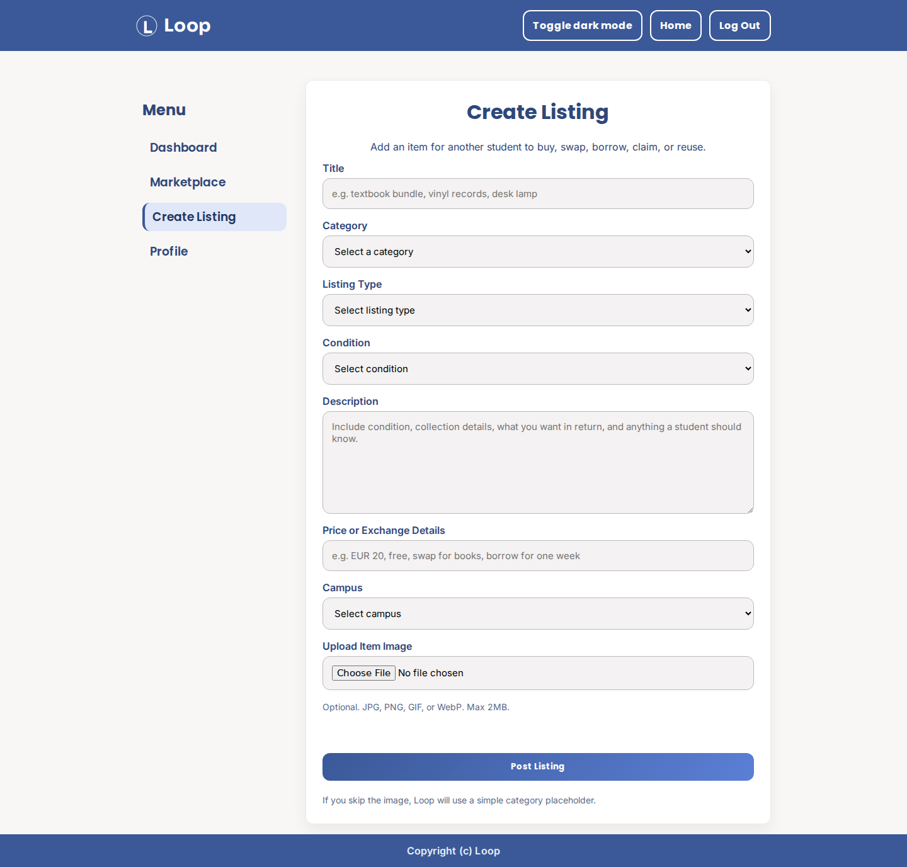
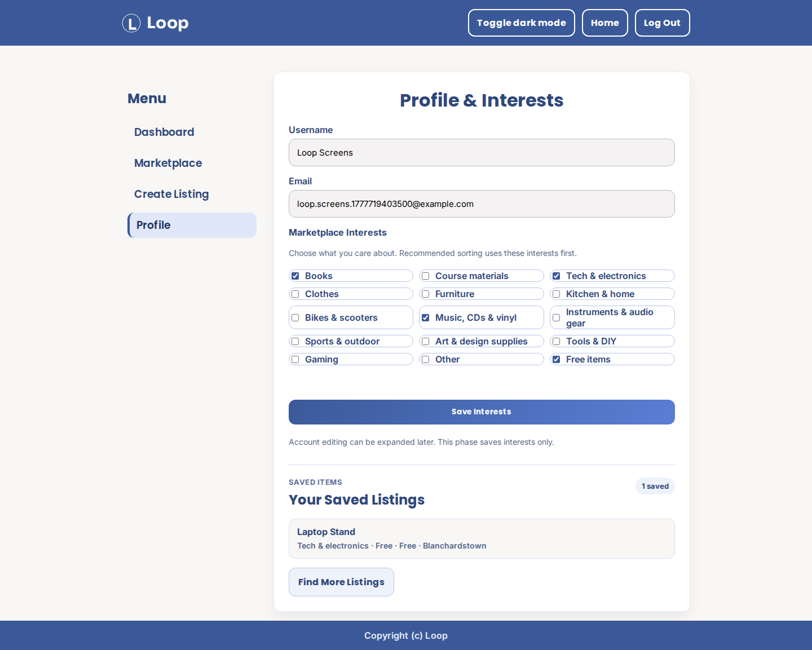

# Loop

Loop is a server-side web development project for a TU Dublin circular marketplace where students can sell, swap, borrow, donate, and give away useful second-hand items across campus.

This repository was prepared for **Server-side Web Development COMP3101**  
**Assignment 2**  
**Academic Term:** Jan-May 2025/26  
**CRN:** 26577

## Project Summary

The website includes a landing page, user registration, login, protected dashboard, logout, profile interests, real listing creation, image upload, listing detail pages, saved listings, and a database-backed marketplace feed.

## Screenshots

These screenshots show the current Loop branding and key user flows.

### Landing and Branding



### Dashboard Launchpad



### Dark Mode



### Marketplace Feed



### Listing Detail



### Create Listing



### Profile, Interests, and Saved Items



The aim of the project is to show core PHP lab topics such as:

- server-side form validation
- XSS prevention
- sessions
- cookies
- redirection after login
- logout handling
- PHP filters

## Assignment Criteria and Where It Is Shown

### 1. PHP server-side form checking (Lab 5)

Implemented in:

- `backend/register_handler.php`

Examples:

- checks for empty username, email, password, and confirm password
- checks that password confirmation matches
- checks that password length is at least 8 characters

### 2. XSS prevention functions (Lab 5)

Implemented in:

- `backend/register_handler.php`

Functions used:

- `trim()`
- `stripslashes()`
- `htmlspecialchars()`

These are used inside the `clean_data()` function before user input is processed.

### 3. Sessions (Lab 6)

Implemented in:

- `backend/register_handler.php`
- `backend/login_handler.php`
- `backend/logout.php`
- `templates/dashboard.php`
- `templates/landing_page.php`
- `templates/register.php`

Examples:

- stores registration and login information in `$_SESSION`
- stores success and error messages in the session
- checks `$_SESSION['login']` before showing the dashboard

### 4. Redirection to login page with error message if invalid login (Lab 6)

Implemented in:

- `backend/login_handler.php`
- `templates/landing_page.php`

The login handler redirects the user back to the landing page if login is not valid.

### 5. Redirection to secure page if valid login (Lab 6)

Implemented in:

- `backend/login_handler.php`
- `templates/dashboard.php`

If login is valid, the user is redirected to the dashboard page.

### 6. Logout option that expires cookies/sessions (Lab 6)

Implemented in:

- `backend/logout.php`

Examples:

- `session_unset()`
- `session_destroy()`
- cookie expiry using `setcookie()`

### 7. Cookies (Lab 6)

Implemented in:

- `backend/login_handler.php`
- `backend/logout.php`
- `templates/landing_page.php`

The project stores the user's email in a cookie and uses it to prefill the login form.

### 8. PHP filters (Lab 6)

Implemented in:

- `backend/register_handler.php`

Example:

- `filter_var($email, FILTER_VALIDATE_EMAIL)`

## Extra Features

- dark mode toggle in `scripts/main.js`
- client-side password confirmation check in `scripts/main.js`
- reusable layout and styling across multiple pages
- password hashing during registration with `password_hash()`
- protected marketplace, create listing, and profile pages
- database-backed listing creation and marketplace browsing
- listing image upload with category placeholder fallback
- listing detail pages with owner-only status actions
- profile interests for simple marketplace personalisation
- saved listings so students can come back to items
- local SVG placeholder images for listing cards
- basic recommendation sorting based on explicit user interests and saved item categories

## Features Added Since the Previous Assignment

- registration form and handler
- login flow
- protected dashboard page
- logout handler
- session-based success and error messages
- cookie support for remembered email
- Phase 1 UI polish for dashboard, marketplace, create listing, and profile pages
- Phase 2 listing storage using a new `listings` table
- Phase 2 `user_interests` table and profile interest checkboxes
- demo listing seed data for testing the marketplace
- simple recommendation score for the Recommended marketplace sort
- listing detail pages with full item information
- owner actions to mark listings active, unavailable, or archived
- image upload support for new listings
- form-state preservation when create-listing validation fails
- saved listings using a new `saved_listings` table
- saved item count on the dashboard
- saved listings preview on the profile page

## Marketplace Features

Loop has moved from a static prototype into a small database-driven marketplace.

Current marketplace behaviour:

- students can create listings from `templates/create_post.php`
- listings are inserted through `backend/listing_create_handler.php`
- marketplace cards are rendered from MySQL in `templates/marketplace.php`
- listing images can be uploaded, with local category artwork used as a fallback
- listing detail pages are shown through `templates/listing_detail.php`
- listing owners can mark their own listings active, unavailable, or archived
- profile interests are saved through `backend/profile_update_handler.php`
- saved listings are handled through `backend/saved_listing_handler.php`
- `backend/recommendations.php` ranks listings for the Recommended sort
- if no interests or saved items exist, the marketplace falls back to newest-style browsing

The recommendation score is intentionally simple:

- category match with a user interest
- category match with previously saved listings
- free/donation boost if the user selected `Free items`
- swap listing boost
- freshness boost for listings created in the last 72 hours
- small random discovery boost

No click tracking, payments, notifications, or advanced machine learning are included yet.

## Project Structure

- `assets/` images and icons
- `assets/listings/` local SVG placeholder images for marketplace listings
- `backend/` PHP handlers and database connection
- `database/` SQL setup and demo seed data
- `scripts/` JavaScript files
- `styles/` CSS files
- `templates/` website pages
- `uploads/listings/` local upload folder for listing images

## Running the Project

### Requirements

- XAMPP
- Apache
- MySQL / MariaDB
- PHP

### Steps

1. Place the project folder inside `htdocs`.
2. Start Apache and MySQL in XAMPP.
3. Create the database `loop_db`.
4. Create a `users` table for registration/login.
5. Run the SQL setup files.
6. Open the project in the browser through localhost.

Example:

`http://localhost/loop/loop/`

### SQL Setup

Run these after creating the original `users` table:

```bash
mysql -u your_mysql_user -p loop_db < database/phase2_loop_tables.sql
mysql -u your_mysql_user -p loop_db < database/seed_demo_listings.sql
mysql -u your_mysql_user -p loop_db < database/phase3_saved_listings.sql
```

The setup files create:

- `listings`
- `user_interests`
- `saved_listings`

The seed file adds realistic demo listings across TU Dublin campuses so the marketplace can be tested immediately.

If you use a different local MySQL username/password, update the command and `backend/db_connect.php` for your environment.

## Main Files

- `index.php`
- `backend/register_handler.php`
- `backend/login_handler.php`
- `backend/logout.php`
- `backend/db_connect.php`
- `backend/listing_create_handler.php`
- `backend/listing_status_handler.php`
- `backend/saved_listing_handler.php`
- `backend/profile_update_handler.php`
- `backend/recommendations.php`
- `templates/landing_page.php`
- `templates/register.php`
- `templates/dashboard.php`
- `templates/marketplace.php`
- `templates/listing_detail.php`
- `templates/create_post.php`
- `templates/profile.php`
- `database/phase2_loop_tables.sql`
- `database/seed_demo_listings.sql`
- `database/phase3_saved_listings.sql`
- `scripts/main.js`

## Current Limitations

- Messaging/contact is still a placeholder.
- Listing editing is not implemented yet.
- Profile editing currently focuses on interests, not full account updates.
- Recommended sorting only uses explicit interests, saved item categories, listing type, freshness, and a small discovery boost.
- Behaviour tracking such as views, searches, messages, claims, and hidden listings is planned for a later phase.
- Uploaded listing images are stored locally and should not be committed to GitHub.

## Note for Submission

For Brightspace submission, the project should be uploaded as a zipped folder containing all required `.php`, `.html`, `.css`, `.js`, and image files.
